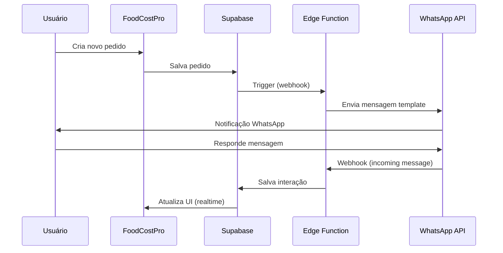

# 📱 Guia Completo: Integração WhatsApp Business API
## FoodCostPro - Comunicação Profissional com Clientes

---

## 📋 Índice

1. [Visão Geral](#visão-geral)
2. [Por que WhatsApp Business API?](#por-que-whatsapp-business-api)
3. [Funcionalidades Disponíveis](#funcionalidades-disponíveis)
4. [Arquitetura Técnica](#arquitetura-técnica)
5. [Casos de Uso](#casos-de-uso)
6. [Templates de Mensagens](#templates-de-mensagens)
7. [Implementação](#implementação)
8. [Custos e Precificação](#custos-e-precificação)
9. [Roadmap de Desenvolvimento](#roadmap-de-desenvolvimento)

---

## 🎯 Visão Geral

A integração do **WhatsApp Business Cloud API** no FoodCostPro permitirá que seu restaurante se comunique de forma **profissional, automatizada e escalável** com seus clientes através do aplicativo de mensagens mais usado no Brasil.

### Diferenças entre WhatsApp Business App vs API

| Recurso | WhatsApp Business App | WhatsApp Business API |
|---------|----------------------|----------------------|
| **Usuários simultâneos** | 1-5 dispositivos | Ilimitado |
| **Mensagens automáticas** | Limitadas | Totalmente automatizadas |
| **Integração com sistemas** | ❌ Não | ✅ Sim |
| **Webhooks/Callbacks** | ❌ Não | ✅ Sim |
| **Volume de mensagens** | Baixo/Médio | Alto/Ilimitado |
| **Templates pré-aprovados** | ❌ Não | ✅ Sim |
| **Melhor para** | Pequenos negócios | Médias e grandes empresas |

---

## 🚀 Por que WhatsApp Business API?

### Benefícios Principais

1. **📈 Alta Taxa de Abertura**: 98% das mensagens são abertas em até 3 minutos
2. **💬 Canal Preferido**: 90% dos brasileiros usam WhatsApp diariamente
3. **🤖 Automação Total**: Notificações automáticas sem intervenção manual
4. **🔔 Tempo Real**: Atualizações instantâneas sobre pedidos
5. **💼 Imagem Profissional**: Conta verificada com selo verde
6. **📊 Métricas Detalhadas**: Rastreamento de entregas e leituras
7. **🔒 Segurança**: Criptografia de ponta-a-ponta

---

## ⚡ Funcionalidades Disponíveis

### 1. **Notificações Automáticas de Pedidos** ⭐ CORE

#### 1.1 Confirmação de Novo Pedido
```
🎉 Pedido Confirmado!

Olá {{customer_name}}! 

Seu pedido #{{order_id}} foi recebido com sucesso!

📦 Itens: {{items_count}}
💰 Total: R$ {{total}}
📍 Entrega: {{delivery_type}}

⏰ Previsão: {{estimated_time}}

Acompanhe em tempo real pelo link:
{{tracking_link}}
```

#### 1.2 Status de Preparação
```
👨‍🍳 Seu pedido está sendo preparado!

Pedido #{{order_id}}
Status: Em preparação 🔥

Nossos chefs estão preparando seu pedido com todo carinho!

Próximo status: Saiu para entrega
```

#### 1.3 Pedido Saiu para Entrega
```
🛵 Pedido a caminho!

Seu pedido #{{order_id}} saiu para entrega!

🏍️ Entregador: {{driver_name}}
📱 Telefone: {{driver_phone}}

📍 Rastreie em tempo real:
{{tracking_map_link}}

⏰ Previsão de chegada: {{eta_minutes}} minutos
```

#### 1.4 Pedido Entregue
```
✅ Pedido Entregue!

Esperamos que você tenha uma ótima experiência! 😊

Como foi sua experiência?
⭐ Avaliar pedido: {{rating_link}}

💝 Ganhe pontos de fidelidade!
Você acumulou {{points_earned}} pontos neste pedido.
Total: {{total_points}} pontos
```

---

### 2. **Sistema de Fidelidade via WhatsApp** 💎

#### 2.1 Pontos Acumulados
```
🎁 Parabéns! Você ganhou pontos!

{{customer_name}}, você acabou de acumular:
⭐ +{{points_earned}} pontos

Seu saldo atual:
💰 {{total_points}} pontos
🏆 Nível: {{current_level}}

Próximo benefício: {{next_reward}}
Faltam: {{points_to_next}} pontos

Resgate seus pontos: {{redemption_link}}
```

#### 2.2 Promoção de Nível
```
🎊 PARABÉNS! Você subiu de nível!

{{customer_name}}, agora você é {{new_level}}! ✨

🎁 Novos benefícios:
• {{discount_percent}}% de desconto em todos os pedidos
• {{benefit_1}}
• {{benefit_2}}

Faça seu próximo pedido:
{{order_link}}
```

#### 2.3 Pontos Prestes a Expirar
```
⚠️ Seus pontos estão expirando!

{{customer_name}}, atenção!

{{expiring_points}} pontos vão expirar em {{days_left}} dias.

💡 Sugestão: Use agora e ganhe:
• R$ {{discount_value}} de desconto
• OU troque por {{reward_option}}

Não perca! Resgatar agora:
{{redeem_link}}
```

---

### 3. **Marketing e Promoções** 📢

#### 3.1 Ofertas Personalizadas
```
🔥 OFERTA ESPECIAL SÓ PARA VOCÊ!

Olá {{customer_name}}! 

Seu prato favorito com desconto hoje:
{{favorite_dish}} - {{discount_percent}}% OFF

De: R$ {{original_price}}
Por: R$ {{discounted_price}}

⏰ Válido até: {{expiry_time}}

Pedir agora: {{order_link}}
```

#### 3.2 Lançamentos de Cardápio
```
🆕 Novidade no Cardápio!

Acabamos de lançar:
{{new_product_name}} 🍽️

{{description}}

🎁 LANÇAMENTO ESPECIAL:
{{launch_offer}}

Preço: R$ {{price}}

Seja o primeiro a experimentar:
{{order_link}}
```

#### 3.3 Promoções de Horário
```
⏰ HAPPY HOUR COMEÇOU!

{{time_range}}

🍺 Bebidas com 30% OFF
🍕 Porções especiais
💵 Combos exclusivos

Peça agora e aproveite:
{{order_link}}

*Promoção válida por tempo limitado
```

---

### 4. **Atendimento ao Cliente** 💬

#### 4.1 Resposta Automática (Fora do Horário)
```
🌙 Olá! Estamos fechados no momento.

⏰ Horário de funcionamento:
{{business_hours}}

📅 Voltamos: {{next_open_time}}

💡 Enquanto isso, você pode:
• Ver nosso cardápio: {{menu_link}}
• Agendar um pedido: {{schedule_link}}
• Acompanhar seu pedido: {{track_link}}

Responderemos assim que abrirmos! ⏰
```

#### 4.2 Menu de Opções Interativo
```
👋 Bem-vindo ao {{restaurant_name}}!

Como posso ajudar?

1️⃣ Fazer um pedido
2️⃣ Ver cardápio completo
3️⃣ Rastrear meu pedido
4️⃣ Falar com atendente
5️⃣ Ver promoções
6️⃣ Programa de fidelidade
7️⃣ Horário de funcionamento

Digite o número da opção desejada.
```

---

### 5. **Recuperação de Carrinho Abandonado** 🛒

```
🛒 Você esqueceu algo no carrinho!

Olá {{customer_name}}! 

Notamos que você deixou itens no seu carrinho:

{{cart_items}}

💰 Total: R$ {{cart_total}}

🎁 OFERTA ESPECIAL:
Complete seu pedido nas próximas {{time_limit}} horas e ganhe:
• {{incentive_offer}}

Finalizar pedido: {{checkout_link}}
```

---

### 6. **Avaliações e Feedback** ⭐

#### 6.1 Solicitação de Avaliação
```
⭐ Como foi sua experiência?

{{customer_name}}, sua opinião é muito importante!

Pedido #{{order_id}}

Avalie de 1 a 5:
⭐ Qualidade da comida
⭐ Tempo de entrega
⭐ Atendimento

Avaliar agora: {{review_link}}

🎁 Ganhe {{bonus_points}} pontos extras por avaliar!
```

#### 6.2 Resposta a Avaliação Negativa
```
😔 Sentimos muito pela sua experiência

Olá {{customer_name}},

Vimos sua avaliação e queremos corrigir isso!

Um gerente entrará em contato em breve.

🎁 Como pedido de desculpas:
{{compensation_offer}}

Estamos comprometidos com sua satisfação!

Falar com gerente: {{contact_link}}
```

---

### 7. **Sistema de Reservas** 📅

```
🍽️ Confirmação de Reserva

Olá {{customer_name}}!

Sua reserva foi confirmada:

📅 Data: {{date}}
⏰ Horário: {{time}}
👥 Pessoas: {{party_size}}
🪑 Mesa: {{table_number}}

📍 Endereço:
{{restaurant_address}}

⚠️ Cancelar ou alterar:
{{manage_reservation_link}}

Lembrete será enviado {{reminder_time}} antes.
Até breve! 🎉
```

---

### 8. **Notificações Operacionais** ⚙️

#### 8.1 Estoque Esgotado
```
⚠️ Item Temporariamente Indisponível

Olá {{customer_name}},

Infelizmente {{product_name}} está esgotado no momento.

💡 Sugestões similares:
• {{alternative_1}}
• {{alternative_2}}

Ou escolha outro item: {{menu_link}}

Desculpe pelo inconveniente!
```

#### 8.2 Atraso na Entrega
```
⏰ Atualização do Pedido

Pedido #{{order_id}}

Devido a {{delay_reason}}, sua entrega terá um pequeno atraso.

Nova previsão: {{new_eta}}
Atraso estimado: +{{delay_minutes}} minutos

🎁 Como compensação:
{{compensation}}

Rastrear: {{tracking_link}}

Pedimos desculpas pelo inconveniente!
```

---

### 9. **Integração com iFood** 🤝

```
🛵 Novo Pedido iFood Recebido!

⚠️ PEDIDO CHEGOU VIA IFOOD

Pedido #{{ifood_order_id}}
Cliente: {{customer_name}}

📦 Itens: {{items}}
💰 Total: R$ {{total}}

⏰ Tempo máximo: {{max_prep_time}}

Status atual: {{current_status}}

Sistema: {{system_link}}
```

---

### 10. **Lembretes Inteligentes** 🔔

#### 10.1 Lembrete de Pedido Recorrente
```
🔄 Já está na hora? 😊

{{customer_name}}, notamos que você costuma pedir {{favorite_item}} às {{usual_time}}.

Quer repetir seu pedido favorito?

📦 Último pedido:
{{last_order_items}}

💰 Total: R$ {{last_order_total}}

🎁 Bônus: {{repeat_order_offer}}

Repetir pedido: {{reorder_link}}
Ou ver cardápio: {{menu_link}}
```

#### 10.2 Aniversário do Cliente
```
🎂 FELIZ ANIVERSÁRIO! 🎉

{{customer_name}}, hoje é seu dia especial!

🎁 Presente da casa:
{{birthday_offer}}

Válido só hoje! 

Resgatar presente: {{redeem_link}}

Feliz aniversário! 🥳🎈
```

---

## 🏗️ Arquitetura Técnica

### Stack Tecnológico

```
┌─────────────────────────────────────────┐
│         FoodCostPro Frontend            │
│         (React + TypeScript)            │
└────────────────┬────────────────────────┘
                 │
                 ↓
┌─────────────────────────────────────────┐
│     Supabase (Backend + Database)       │
│  • Edge Functions (Webhook Handler)     │
│  • Realtime Subscriptions              │
│  • Database (PostgreSQL)               │
└────────────────┬────────────────────────┘
                 │
                 ↓
┌─────────────────────────────────────────┐
│    WhatsApp Business Cloud API          │
│         (Meta/Facebook)                 │
│  • Send Messages                        │
│  • Template Messages                   │
│  • Media Messages                      │
│  • Interactive Messages                │
└─────────────────────────────────────────┘
```

### Fluxo de Dados



---

## 💻 Implementação

### Etapa 1: Estrutura de Banco de Dados

```sql
-- Tabela de configurações WhatsApp
CREATE TABLE whatsapp_config (
    id uuid DEFAULT gen_random_uuid() PRIMARY KEY,
    user_id uuid REFERENCES auth.users(id) ON DELETE CASCADE,
    phone_number_id text NOT NULL,
    business_account_id text NOT NULL,
    access_token text NOT NULL, -- Criptografado
    webhook_verify_token text NOT NULL,
    is_enabled boolean DEFAULT true,
    created_at timestamptz DEFAULT now(),
    updated_at timestamptz DEFAULT now()
);

-- Tabela de templates aprovados
CREATE TABLE whatsapp_templates (
    id uuid DEFAULT gen_random_uuid() PRIMARY KEY,
    user_id uuid REFERENCES auth.users(id),
    name text NOT NULL,
    category text NOT NULL, -- 'utility', 'marketing', 'authentication'
    language text DEFAULT 'pt_BR',
    status text DEFAULT 'pending', -- 'pending', 'approved', 'rejected'
    template_body jsonb NOT NULL,
    created_at timestamptz DEFAULT now()
);

-- Tabela de mensagens enviadas
CREATE TABLE whatsapp_messages (
    id uuid DEFAULT gen_random_uuid() PRIMARY KEY,
    user_id uuid REFERENCES auth.users(id),
    customer_id uuid REFERENCES customers(id),
    order_id uuid REFERENCES orders(id),
    message_type text NOT NULL, -- 'order_confirmed', 'status_update', etc
    template_name text,
    whatsapp_message_id text,
    status text DEFAULT 'pending', -- 'pending', 'sent', 'delivered', 'read', 'failed'
    sent_at timestamptz,
    delivered_at timestamptz,
    read_at timestamptz,
    error_message text,
    created_at timestamptz DEFAULT now()
);

-- Tabela de conversas (para atendimento)
CREATE TABLE whatsapp_conversations (
    id uuid DEFAULT gen_random_uuid() PRIMARY KEY,
    user_id uuid REFERENCES auth.users(id),
    customer_phone text NOT NULL,
    customer_name text,
    last_message_at timestamptz,
    status text DEFAULT 'open', -- 'open', 'closed'
    assigned_to text,
    created_at timestamptz DEFAULT now()
);

-- Tabela de mensagens da conversa
CREATE TABLE whatsapp_conversation_messages (
    id uuid DEFAULT gen_random_uuid() PRIMARY KEY,
    conversation_id uuid REFERENCES whatsapp_conversations(id),
    direction text NOT NULL, -- 'inbound', 'outbound'
    message_type text NOT NULL, -- 'text', 'image', 'document', etc
    content jsonb NOT NULL,
    whatsapp_message_id text,
    created_at timestamptz DEFAULT now()
);
```

### Etapa 2: Atualizar Types

```typescript
// types.ts

export interface WhatsAppConfig {
  id: string;
  user_id: string;
  phone_number_id: string;
  business_account_id: string;
  access_token: string;
  webhook_verify_token: string;
  is_enabled: boolean;
  created_at: string;
  updated_at: string;
}

export interface WhatsAppTemplate {
  id: string;
  user_id: string;
  name: string;
  category: 'utility' | 'marketing' | 'authentication';
  language: string;
  status: 'pending' | 'approved' | 'rejected';
  template_body: any;
  created_at: string;
}

export interface WhatsAppMessage {
  id: string;
  user_id: string;
  customer_id: string;
  order_id?: string;
  message_type: string;
  template_name?: string;
  whatsapp_message_id?: string;
  status: 'pending' | 'sent' | 'delivered' | 'read' | 'failed';
  sent_at?: string;
  delivered_at?: string;
  read_at?: string;
  error_message?: string;
  created_at: string;
}

export type WhatsAppNotificationType = 
  | 'order_confirmed'
  | 'order_preparing'
  | 'order_ready'
  | 'order_out_for_delivery'
  | 'order_delivered'
  | 'order_cancelled'
  | 'loyalty_points_earned'
  | 'loyalty_level_up'
  | 'points_expiring'
  | 'marketing_promo'
  | 'cart_abandoned'
  | 'feedback_request'
  | 'reservation_confirmed'
  | 'birthday_offer';
```

### Etapa 3: Service Layer

```typescript
// services/whatsapp.ts

import { supabase } from '../utils/supabaseClient';
import { WhatsAppConfig, WhatsAppMessage, WhatsAppNotificationType } from '../types';

const WHATSAPP_API_URL = 'https://graph.facebook.com/v18.0';

export const WhatsAppService = {
  /**
   * Enviar mensagem template
   */
  async sendTemplateMessage(
    recipientPhone: string,
    templateName: string,
    parameters: any[],
    notificationType: WhatsAppNotificationType,
    orderId?: string,
    customerId?: string
  ): Promise<{ success: boolean; messageId?: string; error?: string }> {
    try {
      // 1. Buscar configuração do WhatsApp
      const config = await this.getConfig();
      if (!config || !config.is_enabled) {
        return { success: false, error: 'WhatsApp não configurado' };
      }

      // 2. Montar payload da mensagem
      const payload = {
        messaging_product: 'whatsapp',
        to: recipientPhone.replace(/\D/g, ''), // Remove formatação
        type: 'template',
        template: {
          name: templateName,
          language: { code: 'pt_BR' },
          components: [
            {
              type: 'body',
              parameters: parameters.map(p => ({
                type: 'text',
                text: String(p)
              }))
            }
          ]
        }
      };

      // 3. Enviar via API do WhatsApp
      const response = await fetch(
        `${WHATSAPP_API_URL}/${config.phone_number_id}/messages`,
        {
          method: 'POST',
          headers: {
            'Authorization': `Bearer ${config.access_token}`,
            'Content-Type': 'application/json'
          },
          body: JSON.stringify(payload)
        }
      );

      const data = await response.json();

      if (!response.ok) {
        throw new Error(data.error?.message || 'Erro ao enviar mensagem');
      }

      // 4. Salvar log da mensagem
      const { data: { user } } = await supabase.auth.getUser();
      
      await supabase.from('whatsapp_messages').insert({
        user_id: user?.id,
        customer_id: customerId,
        order_id: orderId,
        message_type: notificationType,
        template_name: templateName,
        whatsapp_message_id: data.messages[0]?.id,
        status: 'sent',
        sent_at: new Date().toISOString()
      });

      return { success: true, messageId: data.messages[0]?.id };
    } catch (error: any) {
      console.error('Erro ao enviar mensagem WhatsApp:', error);
      return { success: false, error: error.message };
    }
  },

  /**
   * Buscar configuração do usuário
   */
  async getConfig(): Promise<WhatsAppConfig | null> {
    const { data: { user } } = await supabase.auth.getUser();
    if (!user) return null;

    const { data, error } = await supabase
      .from('whatsapp_config')
      .select('*')
      .eq('user_id', user.id)
      .maybeSingle();

    if (error) {
      console.error('Erro ao buscar config WhatsApp:', error);
      return null;
    }

    return data;
  },

  /**
   * Salvar/atualizar configuração
   */
  async saveConfig(config: Partial<WhatsAppConfig>): Promise<boolean> {
    const { data: { user } } = await supabase.auth.getUser();
    if (!user) return false;

    const { error } = await supabase
      .from('whatsapp_config')
      .upsert({
        user_id: user.id,
        ...config,
        updated_at: new Date().toISOString()
      });

    return !error;
  },

  /**
   * Enviar notificação de novo pedido
   */
  async notifyOrderConfirmed(order: any, customer: any): Promise<boolean> {
    const result = await this.sendTemplateMessage(
      customer.phone,
      'order_confirmed',
      [
        customer.name,
        order.id.substring(0, 8),
        order.items.length,
        order.totalAmount.toFixed(2),
        order.deliveryType === 'delivery' ? 'Entrega' : 'Retirada',
        '30-40 minutos' // Calcular baseado em configuração
      ],
      'order_confirmed',
      order.id,
      customer.id
    );

    return result.success;
  },

  /**
   * Enviar atualização de status
   */
  async notifyOrderStatusChange(
    order: any,
    customer: any,
    newStatus: string
  ): Promise<boolean> {
    const statusTemplates: Record<string, string> = {
      'preparing': 'order_preparing',
      'ready': 'order_ready',
      'delivered': 'order_delivered'
    };

    const templateName = statusTemplates[newStatus];
    if (!templateName) return false;

    const result = await this.sendTemplateMessage(
      customer.phone,
      templateName,
      [order.id.substring(0, 8)],
      newStatus as any,
      order.id,
      customer.id
    );

    return result.success;
  },

  /**
   * Notificar pontos ganhos
   */
  async notifyPointsEarned(
    customer: any,
    pointsEarned: number,
    totalPoints: number,
    currentLevel: string
  ): Promise<boolean> {
    const result = await this.sendTemplateMessage(
      customer.phone,
      'loyalty_points_earned',
      [
        customer.name,
        pointsEarned.toString(),
        totalPoints.toString(),
        currentLevel
      ],
      'loyalty_points_earned',
      undefined,
      customer.id
    );

    return result.success;
  }
};
```

### Etapa 4: Integrar no AppContext

```typescript
// contexts/AppContext.tsx

import { WhatsAppService } from '../services/whatsapp';

// Adicionar ao createOrder
const createOrder = async (orderData: Partial<Order>) => {
  // ... código existente ...
  
  // Após criar pedido
  const newOrder = await supabase.from('orders').insert(orderData).select().single();
  
  // Enviar notificação WhatsApp
  if (customer.phone) {
    await WhatsAppService.notifyOrderConfirmed(newOrder.data, customer);
  }
  
  // ... resto do código ...
};

// Adicionar ao updateOrder
const updateOrder = async (orderId: string, updates: Partial<Order>) => {
  // ... código existente ...
  
  // Se status mudou, notificar
  if (updates.status && customer.phone) {
    await WhatsAppService.notifyOrderStatusChange(
      order,
      customer,
      updates.status
    );
  }
  
  // ... resto do código ...
};
```

### Etapa 5: Componente de Configuração

```typescript
// pages/WhatsAppSettings.tsx

import React, { useState, useEffect } from 'react';
import { WhatsAppService } from '../services/whatsapp';
import { MessageCircle, Check, X, Info } from 'lucide-react';

const WhatsAppSettings: React.FC = () => {
  const [config, setConfig] = useState({
    phone_number_id: '',
    business_account_id: '',
    access_token: '',
    webhook_verify_token: '',
    is_enabled: false
  });
  const [loading, setLoading] = useState(false);
  const [saved, setSaved] = useState(false);

  useEffect(() => {
    loadConfig();
  }, []);

  const loadConfig = async () => {
    const data = await WhatsAppService.getConfig();
    if (data) {
      setConfig(data);
    }
  };

  const handleSave = async () => {
    setLoading(true);
    const success = await WhatsAppService.saveConfig(config);
    setLoading(false);
    
    if (success) {
      setSaved(true);
      setTimeout(() => setSaved(false), 3000);
    }
  };

  return (
    <div className="max-w-4xl mx-auto p-6">
      <div className="bg-white rounded-2xl shadow-lg p-8">
        {/* Header */}
        <div className="flex items-center gap-4 mb-6">
          <div className="p-4 bg-green-100 rounded-xl">
            <MessageCircle className="w-8 h-8 text-green-600" />
          </div>
          <div>
            <h1 className="text-3xl font-bold text-gray-900">WhatsApp Business</h1>
            <p className="text-gray-600">Configurar integração com WhatsApp Cloud API</p>
          </div>
        </div>

        {/* Info Alert */}
        <div className="bg-blue-50 border border-blue-200 rounded-xl p-4 mb-6">
          <div className="flex gap-3">
            <Info className="w-5 h-5 text-blue-600 flex-shrink-0 mt-0.5" />
            <div className="text-sm text-blue-800">
              <p className="font-bold mb-1">Como obter as credenciais?</p>
              <p>
                1. Acesse <a href="https://business.facebook.com" target="_blank" className="underline font-bold">Meta Business</a><br/>
                2. Crie um app WhatsApp Business<br/>
                3. Configure webhooks e obtenha tokens<br/>
                4. Copie as credenciais abaixo
              </p>
            </div>
          </div>
        </div>

        {/* Form Fields */}
        <div className="space-y-4">
          <div>
            <label className="block text-sm font-semibold text-gray-700 mb-2">
              Phone Number ID
            </label>
            <input
              type="text"
              value={config.phone_number_id}
              onChange={(e) => setConfig({ ...config, phone_number_id: e.target.value })}
              className="w-full px-4 py-3 border border-gray-300 rounded-xl focus:ring-2 focus:ring-green-500"
              placeholder="123456789012345"
            />
          </div>

          <div>
            <label className="block text-sm font-semibold text-gray-700 mb-2">
              Business Account ID
            </label>
            <input
              type="text"
              value={config.business_account_id}
              onChange={(e) => setConfig({ ...config, business_account_id: e.target.value })}
              className="w-full px-4 py-3 border border-gray-300 rounded-xl focus:ring-2 focus:ring-green-500"
              placeholder="987654321098765"
            />
          </div>

          <div>
            <label className="block text-sm font-semibold text-gray-700 mb-2">
              Access Token (Permanente)
            </label>
            <input
              type="password"
              value={config.access_token}
              onChange={(e) => setConfig({ ...config, access_token: e.target.value })}
              className="w-full px-4 py-3 border border-gray-300 rounded-xl focus:ring-2 focus:ring-green-500"
              placeholder="EAAxxxxxxxxxx"
            />
          </div>

          <div>
            <label className="block text-sm font-semibold text-gray-700 mb-2">
              Webhook Verify Token
            </label>
            <input
              type="text"
              value={config.webhook_verify_token}
              onChange={(e) => setConfig({ ...config, webhook_verify_token: e.target.value })}
              className="w-full px-4 py-3 border border-gray-300 rounded-xl focus:ring-2 focus:ring-green-500"
              placeholder="seu_token_secreto_123"
            />
          </div>

          <div className="flex items-center justify-between p-4 bg-gray-50 rounded-xl">
            <div>
              <h4 className="font-semibold text-gray-900">Ativar Notificações</h4>
              <p className="text-sm text-gray-600">Enviar mensagens automáticas via WhatsApp</p>
            </div>
            <button
              onClick={() => setConfig({ ...config, is_enabled: !config.is_enabled })}
              className={`relative w-14 h-7 rounded-full transition-colors ${
                config.is_enabled ? 'bg-green-600' : 'bg-gray-300'
              }`}
            >
              <div
                className={`absolute top-0.5 left-0.5 w-6 h-6 bg-white rounded-full transition-transform ${
                  config.is_enabled ? 'translate-x-7' : 'translate-x-0'
                }`}
              />
            </button>
          </div>
        </div>

        {/* Save Button */}
        <button
          onClick={handleSave}
          disabled={loading}
          className="w-full mt-6 bg-green-600 hover:bg-green-700 text-white font-bold py-4 px-6 rounded-xl transition-all flex items-center justify-center gap-2"
        >
          {loading ? (
            <>Salvando...</>
          ) : saved ? (
            <><Check className="w-5 h-5" /> Salvo com Sucesso!</>
          ) : (
            <>Salvar Configurações</>
          )}
        </button>
      </div>
    </div>
  );
};

export default WhatsAppSettings;
```

---

## 💰 Custos e Precificação (2024)

### Modelo de Conversas (Meta)

O WhatsApp Business API cobra por "conversações", não por mensagens individuais:

| Tipo de Conversa | Descrição | Custo (Brasil) |
|------------------|-----------|----------------|
| **Utility** | Notificações (pedidos, entregas, confirmações) | R$ 0,15 - R$ 0,30 |
| **Authentication** | OTP, códigos de verificação | R$ 0,20 - R$ 0,35 |
| **Marketing** | Promoções, ofertas | R$ 0,45 - R$ 0,60 |
| **Service** | Atendimento dentro de 24h (resposta do cliente) | GRÁTIS |

### Janela de Conversação

- **24 horas**: Após cliente enviar mensagem, você tem 24h para responder GRÁTIS
- **Primeira mensagem**: Após 24h, você precisa usar templates (custo aplicado)
- **1.000 conversas grátis/mês**: Meta oferece 1.000 conversas gratuitas mensalmente

### Estimativa de Custos Mensal (FoodCostPro)

Cenário: Restaurante com 500 pedidos/mês

```
Cenário 1: Notificações Básicas
━━━━━━━━━━━━━━━━━━━━━━━━━━━━━━━━
500 pedidos × 3 mensagens (confirmação + status + entrega)
= 1.500 mensagens utility
= 1.500 conversas × R$ 0,20 = R$ 300/mês

Cenário 2: Notificações + Fidelidade
━━━━━━━━━━━━━━━━━━━━━━━━━━━━━━━━
500 pedidos × 4 mensagens (+ pontos)
= 2.000 conversas × R$ 0,20 = R$ 400/mês

Cenário 3: Completo (Notificações + Marketing)
━━━━━━━━━━━━━━━━━━━━━━━━━━━━━━━━
2.000 utility + 500 marketing
= R$ 400 + R$ 225 = R$ 625/mês

💡 Com 1.000 conversas grátis:
Custo real = R$ 625 - R$ 200 = R$ 425/mês
```

### ROI Esperado

```
Investimento: R$ 425/mês
Retorno estimado:
- 15% aumento em pedidos recorrentes = +75 pedidos
- Ticket médio R$ 50 = +R$ 3.750/mês
- Redução de 30% em no-shows = +R$ 500/mês

ROI: ~900% 🚀
```

---

## 📅 Roadmap de Desenvolvimento

### Fase 1: MVP (2-3 semanas) ⭐ PRIORIDADE

- [ ] Setup da infraestrutura WhatsApp Cloud API
- [ ] Criação das tabelas no banco de dados
- [ ] Service layer (WhatsAppService)
- [ ] Página de configuração no Settings
- [ ] Templates básicos:
  - [ ] Confirmação de pedido
  - [ ] Status de preparação
  - [ ] Pedido pronto
  - [ ] Pedido entregue

### Fase 2: Notificações Avançadas (1-2 semanas)

- [ ] Notificação de pontos de fidelidade
- [ ] Subida de nível
- [ ] Pontos expirando
- [ ] Integração com iFood (notificar pedidos externos)

### Fase 3: Marketing (1-2 semanas)

- [ ] Sistema de campanhas
- [ ] Promoções personalizadas
- [ ] Recuperação de carrinho abandonado
- [ ] Ofertas de aniversário
- [ ] Lembretes inteligentes

### Fase 4: Atendimento (2-3 semanas)

- [ ] Inbox de conversas
- [ ] Respostas rápidas
- [ ] Menu interativo
- [ ] Bot de atendimento básico
- [ ] Transferência para atendente humano

### Fase 5: Analytics & Otimização (1 semana)

- [ ] Dashboard de métricas
- [ ] Taxa de entrega
- [ ] Taxa de leitura
- [ ] Conversões por tipo de mensagem
- [ ] A/B testing de templates

---

## 🎯 Recomendações de Implementação

### Prioridades por Plano

#### **Plano Starter** (Local)
- ❌ WhatsApp não necessário (atendimento presencial)

#### **Plano Online** (Delivery)
- ✅ Notificações básicas de pedido
- ✅ Status de entrega
- ❌ Marketing avançado

#### **Plano Pro** (Completo)
- ✅ Todas as funcionalidades
- ✅ Templates ilimitados
- ✅ Campanhas de marketing
- ✅ Atendimento por chat
- ✅ Analytics avançado

### Estratégia de Templates

1. **Criar templates genéricos primeiro**
   - order_confirmed
   - order_status_update
   - order_delivered

2. **Aguardar aprovação do Meta** (24-48h)

3. **Expandir gradualmente**
   - Templates de marketing
   - Templates personalizados por segmento

### Boas Práticas

1. ✅ **Sempre obter opt-in** do cliente (checkbox no cadastro)
2. ✅ **Respeitar horário comercial** para marketing (9h-21h)
3. ✅ **Permitir opt-out fácil**
4. ✅ **Personalizar mensagens** (usar nome do cliente)
5. ✅ **Testar templates** antes de enviar em massa
6. ✅ **Monitorar taxa de leitura** e ajustar
7. ❌ **Nunca enviar spam** (risco de ban)
8. ❌ **Evitar emojis excessivos** nos templates

---

## 🔐 Segurança e Compliance

### LGPD (Lei Geral de Proteção de Dados)

- ✅ Coletar consentimento explícito
- ✅ Permitir exclusão de dados
- ✅ Criptografar access tokens
- ✅ Log de todas as mensagens enviadas
- ✅ Política de privacidade clara

### Melhores Práticas de Segurança

```typescript
// Exemplo: Criptografar access token
import crypto from 'crypto';

const algorithm = 'aes-256-gcm';
const secretKey = process.env.ENCRYPTION_KEY!;

function encrypt(text: string) {
  const iv = crypto.randomBytes(16);
  const cipher = crypto.createCipheriv(algorithm, secretKey, iv);
  let encrypted = cipher.update(text, 'utf8', 'hex');
  encrypted += cipher.final('hex');
  const authTag = cipher.getAuthTag();
  return `${iv.toString('hex')}:${authTag.toString('hex')}:${encrypted}`;
}

function decrypt(encryptedText: string) {
  const [ivHex, authTagHex, encrypted] = encryptedText.split(':');
  const iv = Buffer.from(ivHex, 'hex');
  const authTag = Buffer.from(authTagHex, 'hex');
  const decipher = crypto.createDecipheriv(algorithm, secretKey, iv);
  decipher.setAuthTag(authTag);
  let decrypted = decipher.update(encrypted, 'hex', 'utf8');
  decrypted += decipher.final('utf8');
  return decrypted;
}
```

---

## 📚 Recursos Adicionais

### Documentação Oficial
- [WhatsApp Business Cloud API](https://developers.facebook.com/docs/whatsapp/cloud-api)
- [Message Templates](https://developers.facebook.com/docs/whatsapp/business-management-api/message-templates)
- [Webhooks](https://developers.facebook.com/docs/whatsapp/cloud-api/webhooks)

### Ferramentas Úteis
- [Template Tester](https://business.facebook.com/wa/manage/message-templates/)
- [API Explorer](https://developers.facebook.com/tools/explorer)
- [Webhook Tester](https://webhook.site/)

---

## 📞 Suporte

Em caso de dúvidas sobre a implementação:
- 📧 Email: suporte@foodcostpro.com
- 📱 WhatsApp: (XX) XXXXX-XXXX
- 💬 Chat: [app.foodcostpro.com/support](https://app.foodcostpro.com/support)

---

**Versão do Documento**: 1.0
**Última Atualização**: Dezembro 2024
**Autor**: Equipe FoodCostPro
